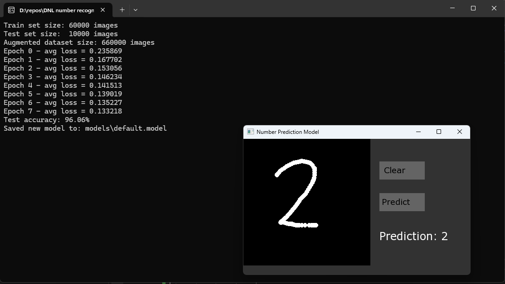

# C++ Handwritten Digit Recognition (MNIST) with GUI

This project implements a **handwritten digit recognition** system in **C++**, trained on the **MNIST** dataset and providing a **GUI** (using **SFML**) where you can draw digits and get real-time predictions. 

## Features

1. **Neural Network from Scratch**  
   - A simple 2-layer neural network using only standard C++ libraries for matrix and vector operations.
   - Supports **forward propagation**, **backpropagation**, and **cross-entropy** loss.

2. **MNIST Data Loading**  
   - Reads the classic MNIST dataset (binary `.idx3-ubyte` and `.idx1-ubyte` files) using a custom `DataReader` class.
   - Automatically **scales** pixel values to `[0..1]`.

3. **Data Augmentation** (Optional)  
   - Functions to randomly **rotate**, **scale**, **translate**, or otherwise transform 28×28 images to expand the training set.

4. **GUI Canvas** with **SFML**  
   - A **280×280** draw area where users can scribble digits.
   - **Buttons** for **Clear** (reset canvas) and **Predict** (run inference).
   - The **prediction** is displayed in the GUI or console.

5. **Model Saving/Loading**  
   - After training, **save** the model’s weights/biases to a binary file.
   - **Load** the model later without re-training, to do quick inference.

## Project 

Project was made in VisualStudio

## Dependencies

- **C++17** or later (for `<filesystem>` and modern features).  
- **SFML** (Simple and Fast Multimedia Library) for GUI rendering and input events. 
